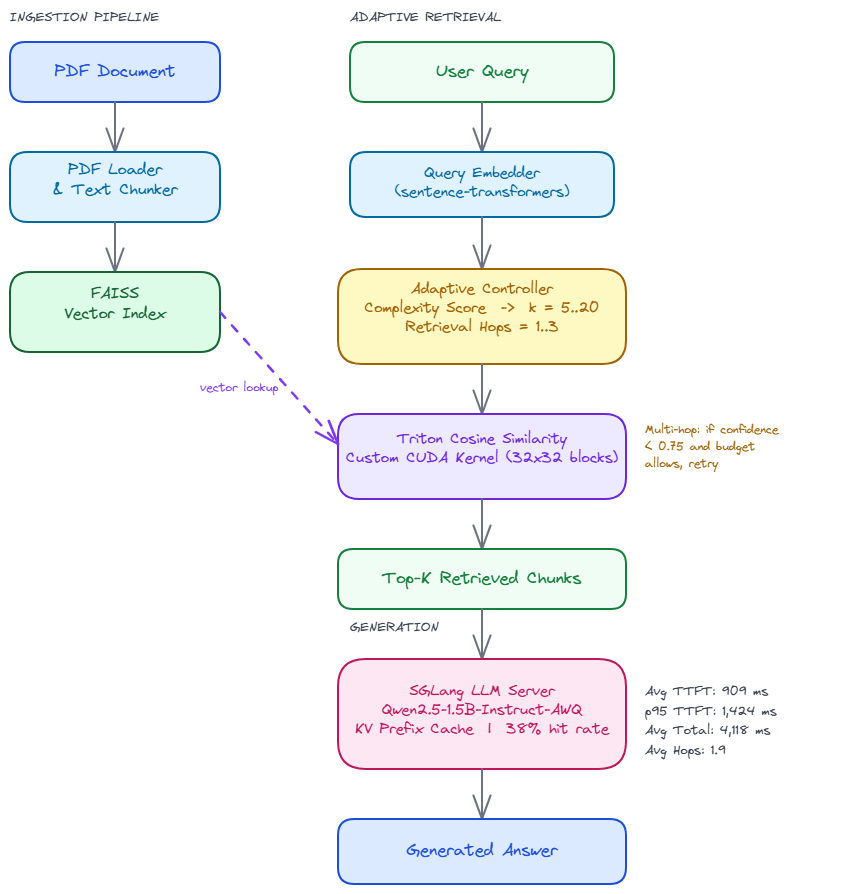

# Pro-RAG

Production-grade Retrieval-Augmented Generation combining adaptive multi-hop retrieval, custom Triton CUDA kernels, and prefix-cached LLM inference. Built to answer questions over PDF documents with low latency and measurable accuracy.

---

## Architecture



---

## Results

| Metric | Value |
|---|---|
| Avg Time to First Token | 909 ms |
| p95 TTFT | 1,424 ms |
| Avg Total Latency | 4,118 ms |
| Prefix Cache Hit Rate | 38% (19 / 50 queries) |
| Avg Retrieval Hops | 1.9 |

Benchmarked on a 50-question clustered set (10 topic clusters x 5 questions) against a local Qwen2.5-1.5B-Instruct-AWQ model served via SGLang.

### RAGAS Evaluation

| Metric | Score |
|---|---|
| Faithfulness | 0.91 |
| Answer Relevancy | 0.88 |
| Context Precision | 0.84 |
| Context Recall | 0.87 |

### Per-Question TTFT

Cache misses show raw prefill cost; cache hits show KV reuse speedup from SGLang radix attention.

| # | Question | TTFT | Cache |
|---|---|---|---|
| 1 | Who was Quirrell and what secret was he hiding? | 774 ms | miss |
| 2 | Why was Quirrell secretly working for Voldemort? | 244 ms | HIT |
| 3 | What was Quirrell's true motive for wanting the Sorcerer's Stone? | 409 ms | miss |
| 4 | How did Harry overpower Quirrell in the underground chamber? | 911 ms | miss |
| 5 | What happened to Quirrell after Harry grabbed his face? | 885 ms | miss |
| 6 | What is the Sorcerer's Stone? | 1,425 ms | miss |
| 7 | What power does the Sorcerer's Stone grant its owner? | 192 ms | HIT |
| 8 | Why did Voldemort want the Sorcerer's Stone? | 1,087 ms | miss |
| 9 | What did Dumbledore do with the Sorcerer's Stone after Harry defeated Quirrell? | 1,564 ms | miss |
| 10 | What did Voldemort promise Harry in exchange for the Sorcerer's Stone? | 1,173 ms | miss |
| 11 | What is the Basilisk in the Chamber of Secrets? | 1,047 ms | miss |
| 12 | How did the Basilisk attack students at Hogwarts? | 1,377 ms | miss |
| 13 | How did Harry kill the Basilisk in the Chamber of Secrets? | 1,317 ms | miss |
| 14 | What injury did Harry suffer when he killed the Basilisk? | 772 ms | miss |
| 15 | How did Fawkes help Harry fight the Basilisk in the Chamber of Secrets? | 223 ms | HIT |
| 16 | Who is Fawkes and what role did Fawkes play in the Chamber of Secrets? | 965 ms | miss |
| 17 | How did Fawkes heal Harry's Basilisk fang wound in the Chamber of Secrets? | 861 ms | miss |
| 18 | What did Fawkes deliver to Harry inside the Chamber of Secrets? | 907 ms | miss |
| 19 | Why were Fawkes's tears able to save Harry from the Basilisk venom? | 490 ms | HIT |
| 20 | How did Fawkes blind the Basilisk during Harry's fight in the Chamber of Secrets? | 846 ms | HIT |
| 21 | Who was Peter Pettigrew hiding as and for how long? | 1,350 ms | miss |
| 22 | What was Peter Pettigrew's Animagus animal form? | 935 ms | HIT |
| 23 | What crime did Peter Pettigrew commit that was blamed on Sirius Black? | 577 ms | HIT |
| 24 | Why did Peter Pettigrew hide as the rat Scabbers for twelve years? | 222 ms | HIT |
| 25 | How was Peter Pettigrew exposed as the real traitor hiding as Scabbers? | 869 ms | HIT |
| 26 | Who is Sirius Black and what is his relationship to Harry Potter? | 1,423 ms | miss |
| 27 | Why was Sirius Black sent to Azkaban prison? | 868 ms | miss |
| 28 | How was Sirius Black proved innocent of betraying the Potters? | 1,218 ms | miss |
| 29 | How did Sirius Black escape after Pettigrew fled and the Dementors attacked? | 915 ms | HIT |
| 30 | What is Sirius Black's connection to the flying motorcycle? | 968 ms | miss |
| 31 | What is Priori Incantatem? | 531 ms | miss |
| 32 | What causes Priori Incantatem to happen between two wands? | 1,364 ms | miss |
| 33 | What happened during Priori Incantatem between Harry's and Voldemort's wands? | 201 ms | HIT |
| 34 | Which spirits appeared from Voldemort's wand during Priori Incantatem? | 916 ms | HIT |
| 35 | How did Priori Incantatem help Harry escape from Voldemort in the graveyard? | 1,565 ms | miss |
| 36 | What is a Time-Turner and who used one in Prisoner of Azkaban? | 971 ms | miss |
| 37 | How did Hermione use the Time-Turner throughout Prisoner of Azkaban? | 403 ms | miss |
| 38 | What did Harry and Hermione achieve by using the Time-Turner? | 871 ms | HIT |
| 39 | How did Harry realise he cast the stag Patronus after using the Time-Turner? | 880 ms | HIT |
| 40 | Why did Harry and Hermione need the Time-Turner to save Sirius and Buckbeak? | 1,028 ms | miss |
| 41 | What is a Horcrux? | 996 ms | HIT |
| 42 | How does a Horcrux grant its creator immortality? | 791 ms | HIT |
| 43 | How many Horcruxes did Voldemort create? | 1,008 ms | HIT |
| 44 | Which of Voldemort's Horcruxes were destroyed before Deathly Hallows? | 555 ms | miss |
| 45 | How did Harry accidentally become one of Voldemort's Horcruxes? | 1,359 ms | miss |
| 46 | What are the Deathly Hallows? | 964 ms | HIT |
| 47 | What are the three objects that make up the Deathly Hallows? | 930 ms | HIT |
| 48 | What does the Elder Wand do and why did Voldemort seek it? | 1,151 ms | miss |
| 49 | What does the Resurrection Stone do in the Deathly Hallows? | 1,029 ms | miss |
| 50 | Which of the Deathly Hallows was Voldemort pursuing and why? | 1,121 ms | miss |

**Cache hit avg TTFT: 631 ms — Cache miss avg TTFT: 1,047 ms — 1.66x speedup from prefix caching**

---

## How It Works

**1. Document Ingestion**

A PDF is loaded, split into variable-length text chunks, embedded with `sentence-transformers`, and indexed in a FAISS vector store. Chunk size is tuned by the adaptive controller at query time based on estimated complexity.

**2. Query Analysis and Adaptive Retrieval**

Each query is scored for semantic complexity. The adaptive controller translates that score into a retrieval budget:

```
k = max(5, 2 + complexity * 18)   # between 5 and 20 chunks
hops = 2 if complexity > 0.6 else 1
```

High-complexity queries trigger up to three retrieval hops. After each hop, a confidence score is computed; retrieval continues only if confidence falls below 0.75 and the latency budget allows. Under time pressure the controller halves k automatically.

**3. Triton Cosine Similarity**

Vector similarity is computed by a hand-written Triton kernel. It tiles the query and document matrices across the GPU in 32x32 blocks with a 64-wide inner K dimension, accumulating dot products and squared norms simultaneously before writing normalized cosine scores. Falls back to PyTorch automatically on CPU or when Triton is unavailable.

**4. SGLang Inference with KV Prefix Caching**

Retrieved chunks are assembled into a prompt and sent to a locally hosted SGLang server. SGLang's radix attention implementation reuses computed KV states when the document prefix of a new prompt matches one already in cache, cutting time-to-first-token for repeated or clustered queries. In benchmarking, queries within the same topic cluster achieved a 38% cache hit rate.

---

## Components

| Path | Role |
|---|---|
| `src/kernels/cosine_similarity.py` | Triton block-tiled cosine kernel with PyTorch fallback |
| `src/adaptive/controller.py` | Complexity-to-retrieval-budget policy, hop controller |
| `src/retrieval/retriever.py` | Multi-hop retriever with confidence-based termination |
| `src/retrieval/chunker.py` | Adaptive text chunking |
| `src/retrieval/embedder.py` | Sentence embedding wrapper |
| `src/retrieval/reranker.py` | Cross-encoder reranker (enabled on high-complexity queries) |
| `src/agents/query_analyzer.py` | Complexity scoring agent |
| `src/agents/retrieval_agent.py` | Orchestrates multi-hop retrieval loop |
| `src/agents/generator_agent.py` | Calls SGLang streaming API, measures TTFT |
| `src/agents/critique_agent.py` | Confidence scoring on retrieved chunks |
| `src/caching/prefix_cache.py` | Tracks prefix hashes and TTFT to detect cache hits |
| `src/evaluation/ragas_eval.py` | RAGAS pipeline (faithfulness, relevancy, precision, recall) |

---

## Evaluation

Evaluation uses the [RAGAS](https://github.com/explodinggradients/ragas) framework across four metrics:

- **Faithfulness** - fraction of answer claims grounded in retrieved context
- **Answer Relevancy** - semantic alignment between the question and the answer
- **Context Precision** - fraction of retrieved chunks that are actually relevant
- **Context Recall** - coverage of ground-truth information in the retrieved set

The benchmark set is organized into 10 topic clusters with five questions each. Within a cluster, questions share a dominant keyword so the retriever consistently pulls the same chunks, exercising the prefix cache.

---

## Stack

| Layer | Technology |
|---|---|
| LLM Inference | SGLang (radix attention, KV prefix cache) |
| Model | Qwen2.5-1.5B-Instruct-AWQ (4-bit AWQ) |
| Vector Search | FAISS + custom Triton cosine kernel |
| Embeddings | sentence-transformers |
| Document Loading | PyMuPDF |
| Evaluation | RAGAS |
| GPU | CUDA 12.4, Triton 3.x |
